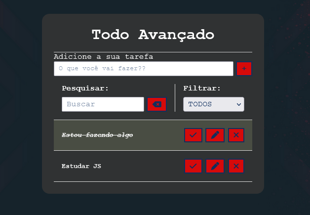

# To-Do List

    

    
Este Projeto foi realizado e baseado no ensinamento do professor Matheus Battisti do Hora de Codar pelo youtube onde foram abordados o uso de HTML, CSS e JavaScript puro.

    <h2>🛠 Tecnologias</h2>
    <ul>
        <li>
            <h4>HTML</h4>
        </li>
        <li>
            <h4>CSS</h4>
        </li>
        <li>
            <h4>JAVASCRIPT</h4>
        </li>
    </ul>

[<h3>👉🏻 <b>Clique aqui para acessar o site</b></h3>](https://ueveton.github.io/Projeto-TODO/)

## 📲 CONTATO

- 💻uevetonsp89@gmail.com
- 💻https://www.linkedin.com/in/ueveton-soares-pereira-99005375/